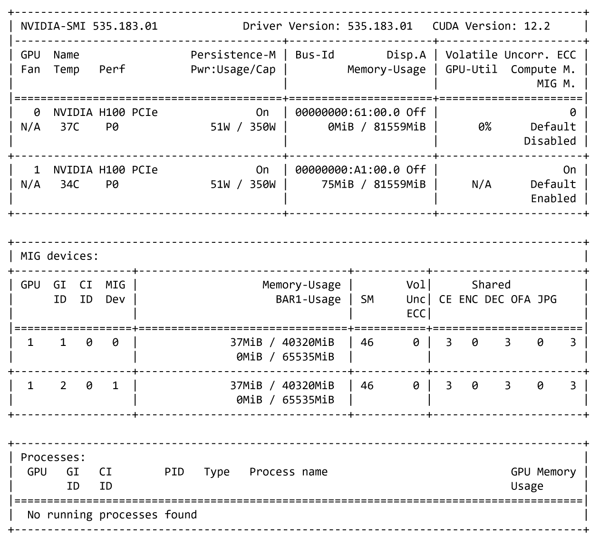
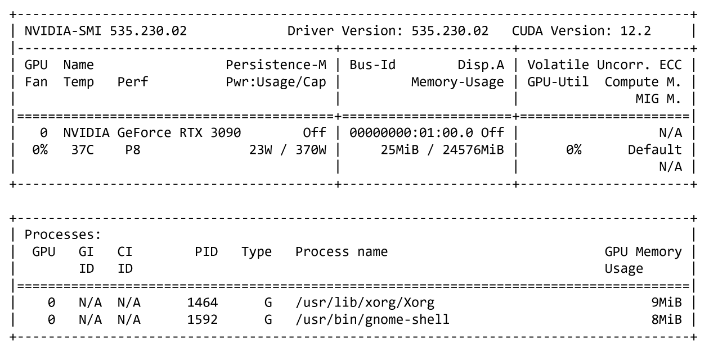

# 회사 프로젝트

본 프로젝트는 안정적이고 유연한 서비스를 제공하기 위해, 리눅스 기반 서버 환경과 최신 컨테이너 관리 기술을 활용하여 효율적인 배포와 운영 체계를 구축하고, 필요 시 손쉽게 확장할 수 있도록 설계되었습니다. 또한, 사용자 경험을 최우선으로 고려한 직관적이고 반응형 프론트엔드 인터페이스를 제공하며, Python 기반 웹 프레임워크를 활용하여 빠르고 매끄러운 UI/UX를 구현하였습니다.

- 서버 환경은 `Ubuntu` 운영체제 기반으로 사용합니다.
- 컨테이너화된 애플리케이션의 효율적인 배포와 안정적인 운영을 위해 `Kubernetes`를 사용합니다.
- AI 모델 개발과 구현에는 `Python`을 사용합니다.

### D-Lab Flow

- [x] 개발 중
- [ ] 개발 완료

`D-Lab Flow` 프로젝트는 **BentoML과 Kubeflow를 활용하여 AI 모델 개발 과정을 간소화**할 수 있습니다.

- AI 모델 훈련 및 추론에는 `NVIDIA GPU H100`의 MIG(Multi-Instance GPU) 기능을 활용하며, GPU 0은 연구원 전용으로, GPU 1은 40GB씩 분할하여 각 기업에서 사용합니다.

### GPU Resource Monitoring

- [x] 개발 중
- [ ] 개발 완료

`GPU Resource Monitoring` 프로젝트는 **GPU 사용량을 실시간으로 추적하고 시각화**하여, 자원을 효율적으로 관리할 수 있습니다.

- 해당 프로젝트는 `NVIDIA GeForce RTX 3090` 환경에서 진행합니다.

